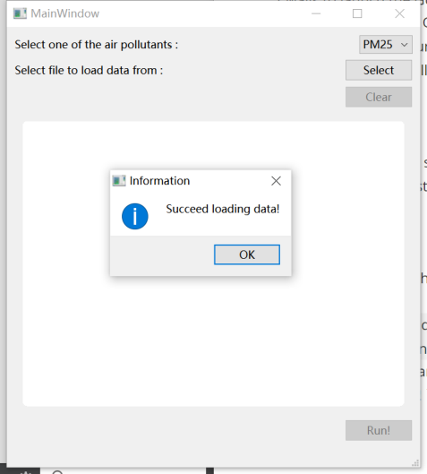

# Stations with top 5 average pollutant degrees
## How to use it?
Two ways to launch the GUI:
+ If you have installed Qt Creator,  just open the folder `loading-file-and-spotting` with Qt Creator and run it in the `Debug` mode;
+ if you have not installed Qt Creator, click into the `pack` folder and run the `.exe` file.

---
Input requirements:
+ The application only support data from `.csv` file.
+ The `.csv` file must end with `'\n'` (Enter key on the keyboard).

---
Steps:
1. Once you launch the GUI, click on the `Select` button and choose a `.csv` file in the file dialog.
	+ This may take quite a long time (minutes) to load the data if its scale is large, because the program stores data with `std::unordered_map`. But once the data is loaded, it takes only O(1) time to show the graphics view. You will see an information message box (shown in the picture below) to inform you that the data is successfully loaded.
	+ 
	 
2. Choose the pollutant in the combo box. (There are now 6 kinds of pollutants)
3. Click on the `Run!` button, and the graph will be shown.
3. Optional: You can click on the `clear` button to clear the data you have loaded and load new data.
